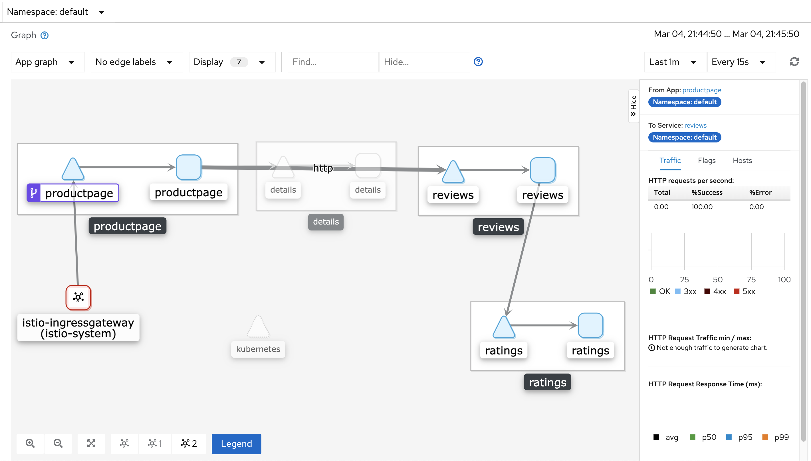

## Observability 

#### Kiali
the Kiali add-on and use the web-based graphical user interface to view service graphs of the mesh and your Istio configuration objects. 

#### Remotely Accessing Kiali Addons

1. Apply networking configuration for the telemetry addons.
`kubectl apply -f assets/kiali.yaml`{{execute}}
2. Visit the Kiali addons via browser.
   https://[[HOST_SUBDOMAIN]]-15029-[[KATACODA_HOST]].environments.katacoda.com/

   *Username: admin*
   *Password: admin* 

#### Let's play with Kiali

1. Make some requests continually with:

`watch -n 1 curl -o /dev/null -s -w %{http_code} $GATEWAY_URL/productpage`{{execute}}

