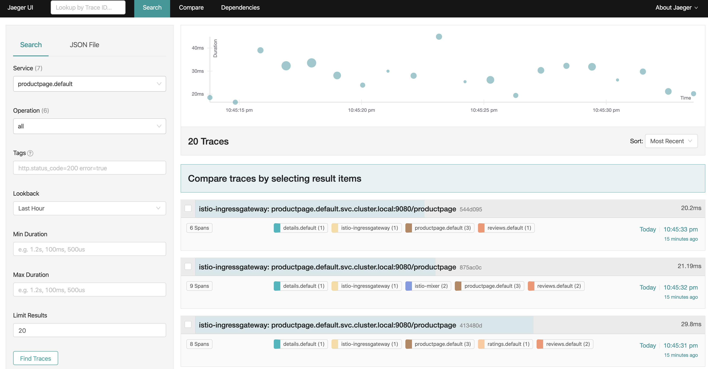

## Observability 

#### Distributed Tracing
Distributed tracing enables users to track a request through mesh that is distributed across multiple services. This allows a deeper understanding about request latency, serialization and parallelism via visualization.
 
#### Remotely Accessing Jeager Addons

1. Apply networking configuration for the Jeager addons.
`kubectl apply -f assets/jeager.yaml`{{execute}}
1. Visit the Jeager via browser.
   https://[[HOST_SUBDOMAIN]]-15032-[[KATACODA_HOST]].environments.katacoda.com/

#### Generating traces using the Bookinfo sample

To see trace data, you must send requests to your service. The number of requests depends on Istio’s sampling rate. You set this rate when you install Istio. The default sampling rate is 1%. You need to send at least 100 requests before the first trace is visible. To send a 100 requests to the productpage service, use the following command:

`watch -n 1 curl -o /dev/null -s -w %{http_code} $GATEWAY_URL/productpage`{{execute}}

